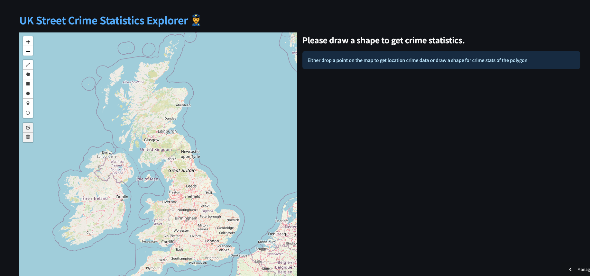
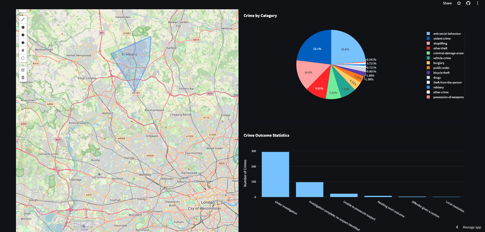

## UK Police API

Crime Statistics Explorer is a Python-based web application designed to provide users with interactive visualization and analysis tools for exploring crime statistics in the UK. Leveraging data sourced from the UK Police street level crime API, the application offers users an intuitive platform to delve into various facets of crime data.

:police_car: [Explore Crime Stats Here](https://uk-street-crime.streamlit.app/)

